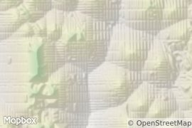

# Higher Ground

The code in this repository processes Open Street Map data to calculate, for each location in a specified region:
  - `d_road`, the distance from that location to the nearest road, and
  - `d_park`, the distance from that location to the nearest park.
  
The results are used for both visualization and analysis.

## Visualization
We visualize the data using techniques that are traditionally employed for rendering topography.
First we define for any point `p` a height `z` by:
```
z(p) = d_road(p) - d_park(p)
```
where `d_road(p)`, `d_park(p)` are the distances from `p` to the nearest road and park, respectively.

We then plug this `z(p)` heightmap and process it with digital elevation map tool (see technical details below) to generate a map like this:

|  |
| --- |
| The hillshaded relief layer. |

Next we take a typical roadmap:

|  |
| --- |
| A standard roadmap. |

And composite the two for our final map:

|  |
| --- |
| The final map. |

## Analysis
By analyzing `d_road` we can identify the parks in a city which are farthest from roads.
These are typically large parks but can also be smaller parks bordered by industrial sites or water.

Conservely we can use `d_park` to find the urban points which are farthest from a park.

## Technical Details
The data is loaded from [OpenStreetmap](https://www.mapbox.com/) (OSM) into a database (PostgreSQL with the PostGIS extension) using the the `osm2pgsql` program.
The OSM extracts from [Mapzen](https://mapzen.com/data/metro-extracts/) or [Geofabrik](http://download.geofabrik.de/) are useful for this.
Distances are calculated with respect to a rasterized grid of a specified resolution using nearest neighbor search with spatial indexing.
The `gdaldem` program is used for processing the raw distance data into separate hillshade, slopeshade, and color relief layers.
The final maps are rendered using [Mapbox](https://www.mapbox.com/).
